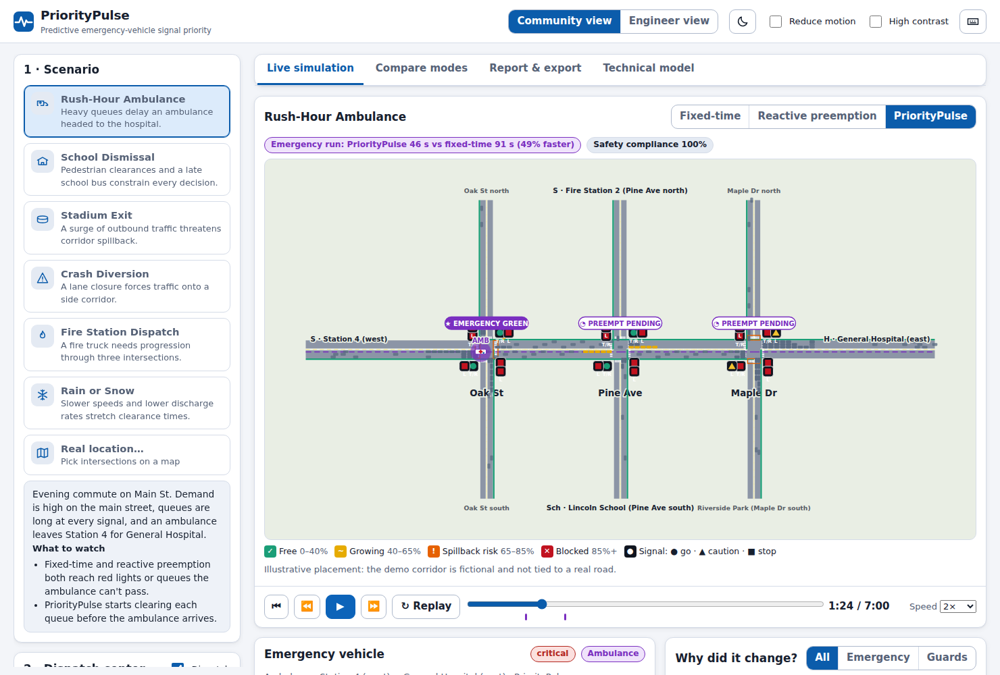
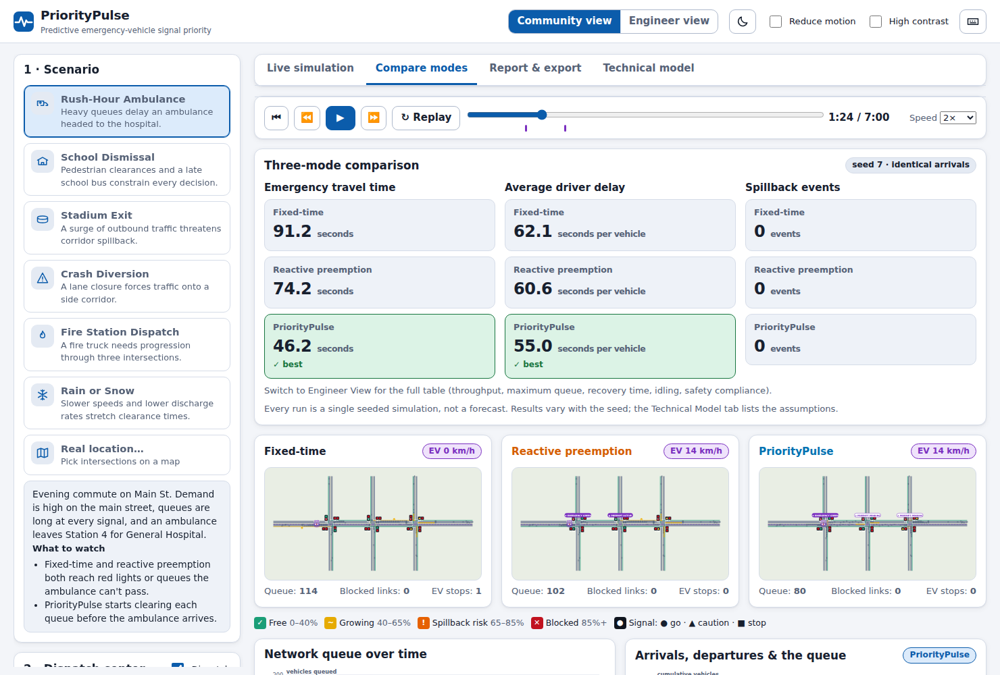
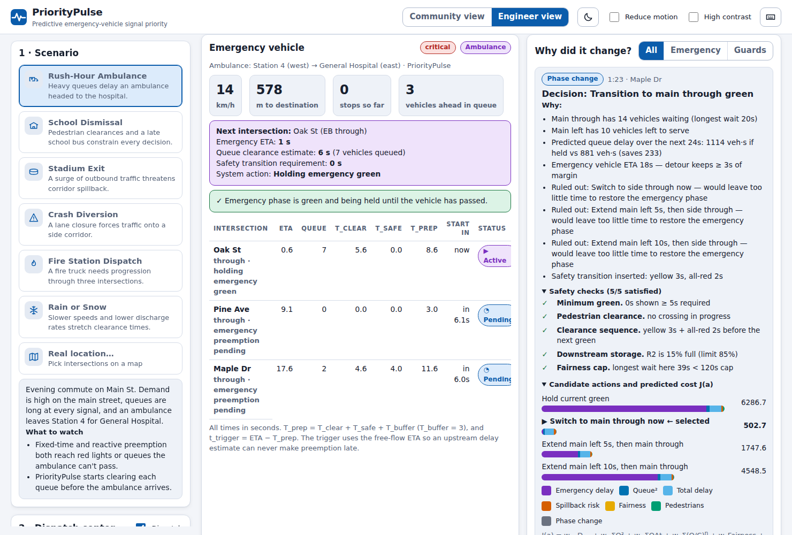
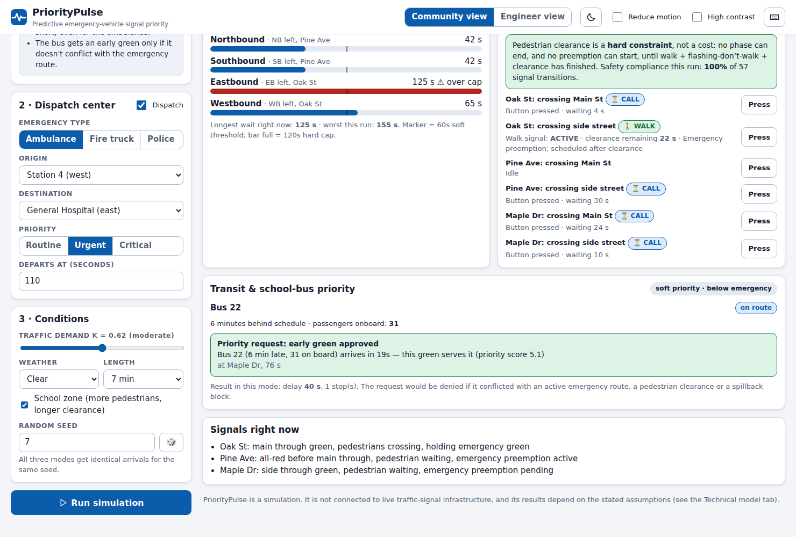

# PriorityPulse

**Predictive emergency-vehicle signal priority — simulated, explained, and checked for safety.**

Every second PriorityPulse predicts how many vehicles will arrive, how long queues will take to clear, when an emergency vehicle will reach each intersection, and whether downstream roads have room. It then chooses the **safest legal** signal action that reduces emergency delay without creating gridlock, unsafe transitions, or unfair delay elsewhere — and tells you *why*.

- **Backend:** Python 3.11+, FastAPI, NumPy — the simulator, the three controllers, the safety monitor, exports.
- **Frontend:** TypeScript, React, Vite — live map, dispatch center, explanations, comparison, report.

| | |
|---|---|
|  |  |
|  |  |

> This is a **simulation**. It is not connected to live traffic-signal infrastructure, and the numbers below come from a model with stated assumptions (see [Limitations](#limitations-and-honest-notes)).

## Quick start

Requirements: Python ≥ 3.11, Node ≥ 20.

```bash
cd prioritypulse
make install          # creates backend/.venv, installs Python + npm dependencies
make serve            # builds the frontend and serves everything on http://localhost:8000
```

For development with hot reload, run the two halves separately:

```bash
make backend          # API on :8000        (uvicorn --reload)
make frontend         # UI on :5173         (Vite, proxies /api to :8000)
```

Other targets: `make test` (pytest + vitest + typecheck), `make bench` (reproduce the results table), `make fuzz`.

Without `make`:

```bash
cd backend && python -m venv .venv && . .venv/bin/activate && pip install -r requirements.txt
python -m uvicorn app.main:app --port 8000
cd ../frontend && npm install && npm run dev
```

## What you can do in the app

| Feature | Where |
|---|---|
| **Three-mode comparison** — fixed-time vs reactive preemption vs PriorityPulse, identical seeded arrivals | *Compare modes* tab (headline numbers; Engineer View shows every metric) |
| **Emergency dispatch** — type, origin, destination, priority, departure time; live ETA at each intersection, queue ahead, `T_clear`, `T_safe`, "begin preemption in *n* s" | Sidebar *Dispatch center* + *Emergency vehicle* panel |
| **Safe preemption sequence** — green → yellow → all-red → emergency green, never shortcut | *Emergency vehicle* panel stepper, enforced by the signal state machine |
| **Queue heatmap & spillback alert** — storage ratio `Q/C` coloured *and* iconed (✓ ~ ! ✕) with hatching on blocked links | Map legend, *Queue storage & spillback* panel |
| **"Why did it change?"** — every phase change with reasons, safety checks, and the cost `J(a)` of each candidate action | *Why did it change?* panel |
| **Pedestrian-safe mode** — walk + flashing-don't-walk + clearance is a hard constraint; school-zone variant; *Press* button re-runs a what-if | *Pedestrian safety* panel |
| **Real-map simulator** — search/click 1–5 intersections, confirm lanes and speeds, optional OpenStreetMap lookup | Sidebar → *Real location…* |
| **Scenario library** — rush hour, school dismissal, stadium exit, crash diversion, fire dispatch, rain/snow | Sidebar |
| **Corridor green wave** — when each intersection turns green for the vehicle, offsets `θ`, recovery stage afterwards | *Corridor green wave* panel |
| **Fairness monitor** — longest wait per direction against the 60 s soft / 120 s hard thresholds | *Fairness monitor* panel |
| **Report & export** — outcome report, metrics / time-series / decision-log / event CSVs, JSON | *Report & export* tab |
| **Transit priority** — late buses get a soft preference *below* the emergency vehicle | *Transit & school-bus priority* panel (school scenario) |
| **Weather / incidents** — slower speeds and lower discharge; lane closures | Scenarios + *Conditions* |
| **Accessibility** — phone layout (map first, "Setup" jump link), keyboard shortcuts (press `?`), colour-blind-safe palette with icons/patterns, reduced motion, high contrast, dark theme, screen-reader announcements, a data table behind each line chart | Header |
| **Community / Engineer view** — plain language vs. queues, constraints and controller cost | Header (or press `V`) |

## How it works

```
 scenario + seed ──► demand (Beta · sigmoid · Poisson, drawn once)
                            │  identical arrivals for every mode
        ┌───────────────────┼───────────────────┐
        ▼                   ▼                   ▼
   fixed-time        reactive preemption     PriorityPulse
   (pre-timed)       (detector, ~12 s)       (MPC + proactive trigger)
        └───────────────────┬───────────────────┘
                            ▼
        signal state machine (the only thing that can change a light)
        G → Y → all-red → G′ · min green · pedestrian clearance · conflicts
                            ▼
        queue physics (dt = 1 s):  Q⁺ = Q + A − D,  D = min[Q+A, s_eff, room]·G·B
                            ▼
        metrics + an independent SafetyMonitor that re-audits every transition
```

**Controllers only *request*; the signal machine decides.** Every controller calls `request_switch()`. The state machine refuses anything illegal (before minimum green, during pedestrian clearance, mid-yellow). A separate `SafetyMonitor` re-derives legality from the transition log — it does not trust the controller or the state machine — and the compliance figure you see is its verdict. Unit tests feed it deliberately illegal logs to prove it flags them.

**PriorityPulse each second, per intersection:**

1. *Predict arrivals* — vehicles already in transit on the approach (exact) plus the expected flow.
2. *Emergency trigger* — `t_trigger = ETA − (T_clear + T_safe + T_buffer)`. `T_safe` includes the remaining minimum green, any pedestrian interval still running, yellow and all-red; `T_clear` is the queue ahead divided by the discharge rate (with start-up lost time).
3. *Enumerate candidates* — hold, extend 5/10 s then switch, switch now — and **filter** by the hard constraints: maximum green, spillback guard, anti-starvation, and (while an emergency is approaching) only detours that still leave time to restore the emergency phase.
4. *Roll each survivor forward 24 s* (vectorised NumPy) and score it with `J(a) = w_EV·D_EV + w_Q·ΣQ² + w_D·ΣQΔt + w_S·spillback + w_F·fairness + w_P·pedestrian + w_C·switch`.
5. *Apply only the first action*, then re-plan (receding horizon).

Where each part of the blueprint lives:

| Layer | Code |
|---|---|
| 0 Network, storage `C = ⌊L·n/h_jam⌋`, conflict matrix | `backend/app/network.py`, `geo.py` |
| 1 Beta / sigmoid / Poisson demand, scenarios | `demand.py`, `scenarios.py` |
| 2 Queue physics, departures, spillback block | `simulator.py` |
| 3 Emergency vehicle, ETA, trigger | `vehicles.py`, `controllers/prioritypulse.py` |
| 4 Signal state machine, MPC | `signals.py`, `controllers/mpc.py` |
| 5 Corridor offsets, guard, fairness | `controllers/prioritypulse.py`, `controllers/fixed.py` |
| Metrics, comparison, report | `metrics.py`, `report.py` |

The **Technical model** tab in the app renders the equations (KaTeX) and lists every place this implementation differs from the written blueprint.

## Results

Reproduce with `make bench` (≈ 35 s). Mean over seeds 1–10; every seed gives all three modes the same arrivals, pedestrian calls and warm-up state. All numbers are simulation output, not field measurements.

| Scenario | EV time vs fixed | EV time vs reactive | PriorityPulse faster than fixed | …than reactive |
|---|---:|---:|---:|---:|
| Rush-Hour Ambulance | 48% faster | 33% faster | 10/10 seeds | 10/10 seeds |
| School Dismissal | 51% faster | 33% faster | 10/10 seeds | 10/10 seeds |
| Stadium Exit | 53% faster | 9% faster | 10/10 seeds | 8/10 seeds |
| Crash Diversion | 65% faster | 26% faster | 10/10 seeds | 10/10 seeds |
| Fire Station Dispatch | 55% faster | 29% faster | 10/10 seeds | 10/10 seeds |
| Rain or Snow | 57% faster | 31% faster | 10/10 seeds | 10/10 seeds |

**What this does and does not show**

- The emergency vehicle is consistently and substantially faster, with essentially no stops (except in the crash scenario, where the route itself runs through the blocked link). The independent safety audit covered all 180 runs of the benchmark (6 scenarios × 10 seeds × 3 modes, 11,781 signal transitions) and found **zero** illegal transitions and **zero** conflicting greens.
- Driver delay is roughly level to modestly better (1.5–6%) in five scenarios — PriorityPulse is not buying emergency speed with driver delay — **except in snow, where its average driver delay is ~3% worse** (70.4 s vs 68.1 fixed-time and 68.3 reactive).
- Against *reactive* preemption the margin is 26–33% in most scenarios but only **9% in the stadium scenario**. There PriorityPulse is slower than reactive on one seed (by 2 s) and tied on another. The cause on that seed is a legitimate earlier decision (serving a 27-vehicle side street while the ambulance was still 48 s away), not a bug.
- Spillback: the guard cuts the time links spend ≥ 85% full by about 60% in the stress scenarios (stadium 499 → 215 s, crash 350 → 133 s versus fixed-time), but it mostly *relocates* the queue upstream rather than preventing it: episodes fall from 2.9 to 1.5 in the stadium scenario but are *not* lower in the crash scenario (4.7 vs 4.0 for fixed-time), and the stadium *maximum queue* is slightly higher (44.8 vs 43.7).
- The 120 s fairness cap is **not** absolute: pedestrian clearance, emergency preemption and the spillback guard outrank it, so PriorityPulse's longest wait exceeds 120 s in the school (146 s) and crash (162 s) scenarios. The baselines exceed it too: reactive preemption reaches 170–180 s in the rush-hour and school scenarios, and fixed-time reaches 191 s in the crash scenario.
- Also measured: the late bus in the school scenario is delayed ≈ 22 s under PriorityPulse versus ≈ 64 s (fixed-time) and ≈ 63 s (reactive), mean of 10 seeds, without slowing the ambulance.
- A tuning note: investigating the stadium result found a real flaw — the controller could give up an emergency phase for a detour whose safety check assumed the queue would not grow while that phase was red. The check now inflates the arrival forecast (×1.4 + 2 vehicles) and is covered by unit tests. It improved the mean emergency time in five of six scenarios (by 0.6–6.4 s; fire dispatch was unchanged) and cost a few seconds of longest wait; I re-ran the full safety audit on the final code (180 runs, 11,781 transitions, zero violations) and stopped there rather than tune against individual seeds.

## Project layout

```
prioritypulse/
├── backend/
│   ├── app/
│   │   ├── main.py            FastAPI routes
│   │   ├── runner.py          build → run three modes → compare; in-memory run store
│   │   ├── simulator.py       Layer-2 physics
│   │   ├── signals.py         signal state machine, pedestrian stages, SafetyMonitor
│   │   ├── vehicles.py        emergency vehicle / bus model
│   │   ├── controllers/       fixed.py · reactive.py · prioritypulse.py · mpc.py
│   │   ├── network.py geo.py demand.py scenarios.py metrics.py report.py schemas.py config.py
│   ├── scripts/benchmark.py   reproduces the results table
│   ├── scripts/fuzz.py        random valid requests: no crash, safety 100%
│   └── tests/                 129 tests (physics, safety, controllers, API, robustness)
├── frontend/src/              React + TypeScript (components/, lib/, api.ts, types.ts)
├── docs/screenshots/
└── Makefile
```

## API

| Method & path | Purpose |
|---|---|
| `GET /api/scenarios` · `/api/meta` · `/api/network/demo` | Library, defaults, demo graph |
| `POST /api/runs` | Run one or all modes; returns frames, events, decisions, metrics, comparison |
| `POST /api/network/from-points` | Build a corridor from 1–5 map points (+ optional OSM lookup) |
| `POST /api/osm/enrich` | Lane / speed suggestions (best effort; degrades gracefully offline) |
| `GET /api/runs/{id}/export.csv?kind=metrics\|timeseries\|events\|decisions&mode=…` | CSV exports |
| `GET /api/runs/{id}/report.md` · `report.json` | Outcome report |

Interactive docs at `/docs` when the server is running. Weight overrides on `/api/runs` are validated against hard bounds.

## Testing

```bash
make test
```

- **Backend (pytest):** vehicle conservation every step, discharge ≤ saturation flow, start-up lost time, spillback guard, conflict matrix, signal legality, the safety monitor catching illegal logs, the trigger arithmetic `t_trigger = ETA − (T_clear + T_safe + T_buffer)` checked in every recorded frame, pedestrian-walk-never-overlaps-conflicting-green over whole runs, determinism, API validation.
- **Robustness:** `scripts/fuzz.py` fires random valid requests (1–5 intersection map corridors at any bearing, random dispatch stations and times, weather, school zone, injected pedestrian calls) and checks for crashes, safety violations and frame-count errors; ~460 requests found two real bugs (both fixed), and a fixed-seed sample runs in the test suite. Vehicle conservation is also tested on corridors with 1, 2 and 5 intersections and different lane counts.
- **Accessibility:** axe-core reports **zero violations** across 18 desktop page states (4 tabs × Community/Engineer × light/dark, plus the help and location dialogs) and 8 phone-width states, with no horizontal overflow at 360–1024 px. axe only catches a subset of problems and I have **not** tested with a real screen reader.
- **Frontend (vitest + `tsc`):** heat scale, geometry, formatting, validation-error formatting. The UI was also exercised in headless Chromium (keyboard shortcuts, scenario switch, what-if pedestrian press, map-based network build, dark / high-contrast / reduced-motion).

## Limitations and honest notes

- **A model, not reality.** Demand, saturation flows, spacing, signal timing and the vehicle behaviour rules are assumptions; no calibration against field data has been done. Treat comparisons between modes as meaningful and absolute numbers as illustrative.
- **PriorityPulse is told about a call 20 s before departure** (crew turnout); the baselines are not. All modes warm up under the same fixed-time plan so they start from an identical state.
- **Simplified geometry:** one main street, one side street per intersection, protected left turns, four phases. Map-based mode uses your clicked positions and spacing but does not import turn lanes or real signal plans, and uses straight links.
- **Single emergency vehicle** per run; buses are scheduled by the scenario.
- **Idling, not CO₂.** The report states "estimated idling reduction"; an optional CO₂ figure uses an *assumed* 0.7 g per idling vehicle-second, flagged as a scenario parameter.
- Run results are kept in server memory (the 8 most recent) for exports; nothing is persisted.
- Address search and map tiles use OpenStreetMap services from the browser and the optional lane lookup uses Overpass from the server; all are optional and the app works offline without them.
